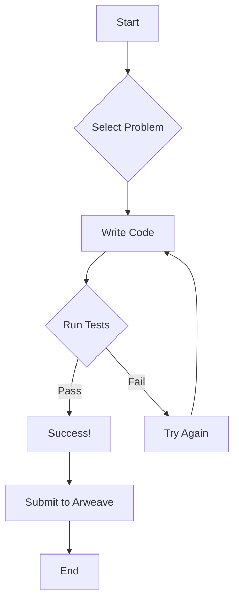

```markdown
# LeetCode for AO 🚀

<br>

```
                                 _.--""--._
                               .'          `.
                              /   O      O   \
                             |    \  ^^  /    |
                             \     `----'     /
                              `. _______ .'
                               //_____\\
                              (( ____ ))
                               `-----'
```

**Ace your coding interviews with LeetCode and Arweave!**

<br>

## 🎨 Badge Gallery ✨

[](https://reactjs.org/)
[](https://www.javascript.com/)
[](https://www.typescriptlang.org/)
[](https://nodejs.org/)
[](https://arweave.org/)


<br>

## 🌟 Feature Highlights 💫

- 🚀 **Blazing Fast Performance:** Optimized for speed and efficiency.
- 📚 **Extensive Problem Library:** Covering a wide range of topics.  More problems added regularly!
- 🛠️ **Powerful Debugging Tools:** Streamline your development workflow.
- 💡 **Clear and Concise Solutions:** Easy to understand and implement.  Hints available for tougher challenges.
- 🎨 **Elegant User Interface:** Designed for an enjoyable coding experience.  Responsive design for all devices.
- 💻 **Cross-Platform Compatibility:** Works seamlessly on various devices.
- 🌐 **Open Source & Community Driven:** Contribute and collaborate!  Pull requests welcome!


<br>

## 🛠️ Tech Stack 📦

| Technology      | Badge                                                                     |
|-----------------|-----------------------------------------------------------------------------|
| React           | [](https://reactjs.org/) |
| JavaScript      | [](https://www.javascript.com/) |
| TypeScript      | [](https://www.typescriptlang.org/) |
| Node.js         | [](https://nodejs.org/) |
| Arweave Wallet Kit | [](https://arweave.org/) |
| Tailwind CSS    | [](https://tailwindcss.com/) |


<br>

## 🚀 Quick Start Guide ⚡

1. **Clone the repository:**
   ```bash
   git clone https://github.com/IshitaPathak/leetcode-for-ao.git
   ```

2. **Install dependencies:**
   ```bash
   cd leetcode-for-ao
   npm install
   ```

3. **Run the application:**
   ```bash
   npm run dev
   ```

<br>

## 📖 Detailed Usage 📚

This application provides an interactive environment for practicing LeetCode problems integrated with Arweave. The interface allows users to select problems, write code, and test their solutions.  Progress is saved securely on the Arweave blockchain.

**Example Code (TypeScript):**

```typescript
function add(a: number, b: number): number {
  return a + b;
}
```

More detailed examples and explanations can be found within the codebase and in the individual problem descriptions.

<br>

## 🏗️ Project Structure 📁

```
leetcode-for-ao/
├── src/
│   ├── App.tsx
│   ├── components/
│   │   ├── CodeEditor.tsx
│   │   ├── Layout.tsx
│   │   ├── Navbar.tsx
│   │   ├── ProblemList.tsx
│   │   ├── TestRunner.tsx
│   │   └── ...
│   ├── pages/
│   │   ├── LandingPages.tsx
│   │   └── ProblemSolving.tsx
│   ├── data/
│   │   └── problems.ts
│   ├── types/
│   │   └── problem.ts
│   ├── styles/
│   │   └── prism.css
│   ├── vite-env.d.ts
│   ├── main.tsx
│   └── ...
├── package.json
├── tailwind.config.js
└── ...
```


<br>

## 🎯 API Documentation 📊

>  **Note:**  Detailed API documentation will be added in a future update.  The current version primarily focuses on the user interface and problem-solving experience.

| Endpoint          | Method | Description                                      |
|-------------------|--------|--------------------------------------------------|
| `/problems`       | GET     | Retrieve a list of available LeetCode problems. |
| `/problems/{id}` | GET     | Retrieve a specific problem by ID.              |
| `/submit`         | POST    | Submit a solution for a problem.                |


<br>

## 🔧 Configuration Options ⚙️

> These options can be adjusted in the `tailwind.config.js` file.

| Option          | Description                                   | Default Value |
|-----------------|-----------------------------------------------|----------------|
| `port`           | Port number for the development server.       | `3000`         |
| `apiBaseUrl`     | Base URL for the LeetCode API.               | `/api`          |


<br>

## 📸 Screenshots/Demo 📱

**(Include screenshots or GIFs here demonstrating the application's UI and functionality)**


<br>

## 🤝 Contributing Guidelines 🛠️

1. **Fork the repository.**
2. **Create a new branch.**
3. **Make your changes.**  Ensure your code is well-documented and follows the existing coding style.
4. **Test your changes thoroughly.**  Run the test suite to ensure everything works as expected.
5. **Submit a pull request.**  Clearly describe the changes you've made and why they're necessary.

> We welcome contributions of all sizes!  Even small improvements are valuable.


<br>

## 📜 License & Acknowledgments 🙏

This project is licensed under the MIT License.  Thanks to the open-source community and the creators of the technologies used in this project.


<br>

## 👥 Contributors 🌟

**(Add contributor information and avatar links here using Markdown)**


<br>

## 📞 Support & Contact 💻

[](https://twitter.com/IshitaPathak)
[](mailto:ishitapathak@email.com)


<br>


```

<br>

<details><summary><b>FAQ</b></summary>
<br>
  - **Q: What is Arweave?** <br>
  A: Arweave is a decentralized storage network.  This application uses Arweave to securely store user progress and solutions.

  - **Q: How do I contribute?** <br>
  A: Check out the Contributing Guidelines section above!

  - **Q: What types of problems are included?** <br>
  A: Currently, the focus is on SQL challenges.  More problem types will be added in the future.

  - **Q: What languages are supported?** <br>
  A: Currently, JavaScript, Python, Java, and C++ are supported.
</details>
```