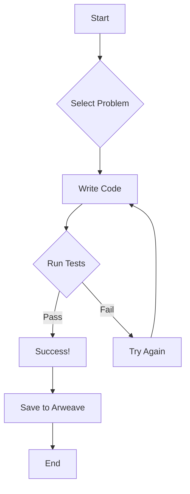

```markdown
# LeetCode for Arweave (AO) 🚀

<br>

```
                                 _.--""--._
                               .'          `.
                              /   O      O   \
                             |    \  ^^  /    |
                             \     `----'     /
                              `. _______ .'
                               //_____\\
                              (( ____ ))
                               `-----'
```

**Level up your coding skills with LeetCode challenges, powered by the Arweave blockchain!**

<br>

## 🎨 Badge Gallery ✨

[](https://reactjs.org/)
[](https://www.javascript.com/)
[](https://www.typescriptlang.org/)
[](https://nodejs.org/)
[](https://arweave.org/)
[](https://tailwindcss.com/)


<br>

## 🌟 Feature Highlights 💫

- 🚀 **Blazing Fast Performance:** Optimized for speed and efficiency.
- 📚 **Extensive Problem Library:**  A curated selection of SQL challenges, with more to come!
- 🛠️ **Powerful Debugging Tools:** Integrated code editor with syntax highlighting and test runner.
- 💡 **Clear and Concise Solutions:** Hints and example solutions available for selected problems.
- 🎨 **Elegant User Interface:**  Modern, responsive design for a smooth coding experience.
- 💻 **Cross-Platform Compatibility:** Works on desktops and mobile devices.
- 🌐 **Decentralized Storage (Arweave):** Securely store your code and progress on the Arweave blockchain.
- 🤝 **Open Source & Community Driven:** Contribute and collaborate! Pull requests are welcome.


<br>

## 🛠️ Tech Stack 📦

| Technology      | Badge                                                                     |
|-----------------|-----------------------------------------------------------------------------|
| React           | [](https://reactjs.org/) |
| JavaScript      | [](https://www.javascript.com/) |
| TypeScript      | [](https://www.typescriptlang.org/) |
| Node.js         | [](https://nodejs.org/) |
| Arweave         | [](https://arweave.org/) |
| Tailwind CSS    | [](https://tailwindcss.com/) |
| Vite            | [](https://vitejs.dev/) |


<br>

## 🚀 Quick Start Guide ⚡

1. **Clone the repository:**
   ```bash
   git clone https://github.com/IshitaPathak/leetcode-for-ao.git
   ```

2. **Navigate to the project directory:**
   ```bash
   cd leetcode-for-ao
   ```

3. **Install dependencies:**
   ```bash
   npm install
   ```

4. **Start the development server:**
   ```bash
   npm run dev
   ```

<br>

## 📖 Detailed Usage 📚

This application provides a user-friendly interface for practicing LeetCode-style SQL problems.  The application leverages Arweave for secure and persistent storage of user progress.

**Example Problem (SQL):**

```sql
-- Select all columns from the 'users' table where the city is 'Delhi'
SELECT * FROM users WHERE city = 'Delhi';
```

The application provides an integrated code editor, test runner, and a problem selection interface.  Detailed instructions are provided within the application itself.

<br>

## 🏗️ Project Structure 📁

```
leetcode-for-ao/
├── src/
│   ├── App.tsx             // Main application component
│   ├── components/         // Reusable UI components
│   │   └── ...
│   ├── pages/              // Application pages
│   │   └── ...
│   ├── data/               // Problem data
│   │   └── problems.ts     // Array of problem objects
│   ├── types/              // Type definitions
│   │   └── ...
│   ├── styles/             // CSS styles
│   │   └── ...
│   ├── main.tsx            // Application entry point
│   └── ...
├── package.json            // Project dependencies
├── tailwind.config.js      // Tailwind CSS configuration
└── ...
```

<br>

## 🎯 API Documentation 📊

>  **Note:** The current version primarily focuses on the user interface and problem-solving experience.  A dedicated API will be developed in future iterations.


<br>

## 🔧 Configuration Options ⚙️

>  Configuration options are primarily managed through environment variables and the `tailwind.config.js` file.

| Option          | Description                                   | Default Value |
|-----------------|-----------------------------------------------|----------------|
| `NODE_ENV`       | Environment (development, production)          | `development`  |
| `PORT`           | Port number for the development server.       | `3000`         |


<br>

## 📸 Screenshots/Demo 📱

**(Include screenshots or GIFs here demonstrating the application's UI and functionality)**

<br>

## 🤝 Contributing Guidelines 🛠️

We welcome contributions of all sizes! Please follow these guidelines:

1. **Fork the repository:** Create a fork of the `leetcode-for-ao` repository on GitHub.
2. **Clone your fork:** Clone your forked repository to your local machine.
3. **Create a branch:** Create a new branch for your feature or bug fix.
4. **Make your changes:**  Write clean, well-documented code.  Follow the existing coding style.
5. **Test your changes:** Ensure your changes work as expected.
6. **Commit your changes:** Commit your changes with clear and concise messages.
7. **Push your branch:** Push your branch to your forked repository.
8. **Create a pull request:** Create a pull request to merge your changes into the main repository.


<br>

## 📜 License & Acknowledgments 🙏

This project is licensed under the MIT License.  Thanks to the open-source community and the creators of the technologies used in this project.


<br>

## 👥 Contributors 🌟

**(Add contributor information and avatar links here using Markdown)**


<br>

## 📞 Support & Contact 💻

[](https://twitter.com/IshitaPathak)
[](mailto:ishitapathak@email.com)


<br>



<br>

<details><summary><b>FAQ</b></summary>
<br>
  - **Q: What is Arweave?** <br>
  A: Arweave is a decentralized storage network. This application uses Arweave to securely store user progress and solutions, ensuring data persistence and immutability.

  - **Q: How do I contribute?** <br>
  A: Check out the Contributing Guidelines section above!

  - **Q: What types of problems are included?** <br>
  A: Currently, the focus is on SQL challenges. More problem types (e.g., JavaScript, Python) will be added in the future.

  - **Q: What languages are supported?** <br>
  A:  The current version supports SQL.  Support for other languages is planned for future releases.
</details>
```
