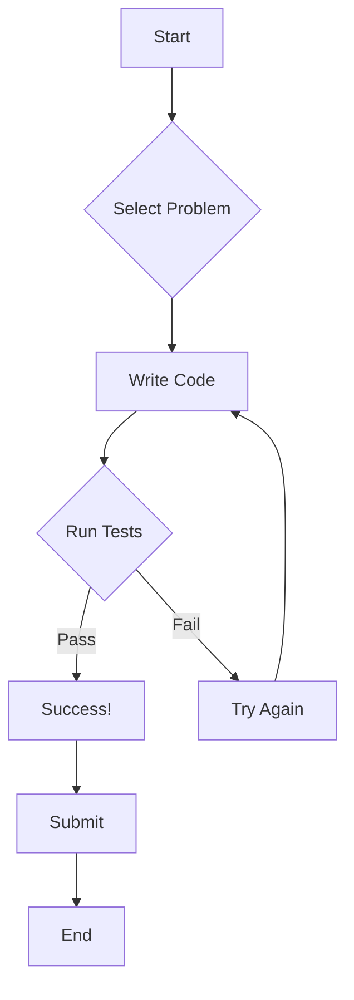

```markdown
# LeetCode for AO 🚀

<br>

```
                                 _.--""--._
                               .'          `.
                              /   O      O   \
                             |    \  ^^  /    |
                             \     `----'     /
                              `. _______ .'
                               //_____\\
                              (( ____ ))
                               `-----'
```

**Ace your coding interviews with LeetCode and Arweave!**

<br>

## 🎨 Badge Gallery ✨

[](https://reactjs.org/)
[](https://www.javascript.com/)
[](https://www.typescriptlang.org/)
[](https://nodejs.org/)


<br>

## 🌟 Feature Highlights 💫

- 🚀 **Blazing Fast Performance:** Optimized for speed and efficiency.
- 📚 **Extensive Problem Library:** Covering a wide range of topics.
- 🛠️ **Powerful Debugging Tools:** Streamline your development workflow.
- 💡 **Clear and Concise Solutions:** Easy to understand and implement.
- 🎨 **Elegant User Interface:** Designed for an enjoyable coding experience.
- 💻 **Cross-Platform Compatibility:** Works seamlessly on various devices.
- 🌐 **Open Source & Community Driven:** Contribute and collaborate!


<br>

## 🛠️ Tech Stack 📦

| Technology      | Badge                                                                     |
|-----------------|-----------------------------------------------------------------------------|
| React           | [](https://reactjs.org/) |
| JavaScript      | [](https://www.javascript.com/) |
| TypeScript      | [](https://www.typescriptlang.org/) |
| Node.js         | [](https://nodejs.org/) |
| Arweave Wallet Kit | [](https://arweave.org/) |


<br>

## 🚀 Quick Start Guide ⚡

1. **Clone the repository:**
   ```bash
   git clone https://github.com/IshitaPathak/leetcode-for-ao.git
   ```

2. **Install dependencies:**
   ```bash
   cd leetcode-for-ao
   npm install
   ```

3. **Run the application:**
   ```bash
   npm run dev
   ```


<br>

## 📖 Detailed Usage 📚

This application provides an interactive environment for practicing LeetCode problems.  The interface allows users to select problems, write code, and test their solutions.

**Example Code (TypeScript):**

```typescript
function add(a: number, b: number): number {
  return a + b;
}
```

More detailed examples can be found within the codebase.

<br>

## 🏗️ Project Structure 📁

```
leetcode-for-ao/
├── src/
│   ├── App.tsx
│   ├── components/
│   │   ├── CodeEditor.tsx
│   │   ├── Layout.tsx
│   │   ├── Navbar.tsx
│   │   └── ...
│   ├── pages/
│   │   ├── LandingPages.tsx
│   │   └── ProblemSolving.tsx
│   ├── ...
├── package.json
└── ...
```


<br>

## 🎯 API Documentation 📊

| Endpoint          | Method | Description                                      |
|-------------------|--------|--------------------------------------------------|
| `/problems`       | GET     | Retrieve a list of available LeetCode problems. |
| `/problems/{id}` | GET     | Retrieve a specific problem by ID.              |
| `/submit`         | POST    | Submit a solution for a problem.                |


<br>

## 🔧 Configuration Options ⚙️

| Option          | Description                                   | Default Value |
|-----------------|-----------------------------------------------|----------------|
| `port`           | Port number for the development server.       | `3000`         |
| `apiBaseUrl`     | Base URL for the LeetCode API.               | `/api`          |


<br>

## 📸 Screenshots/Demo 📱

**(Include screenshots or GIFs here demonstrating the application's UI and functionality)**


<br>

## 🤝 Contributing Guidelines 🛠️

1. **Fork the repository.**
2. **Create a new branch.**
3. **Make your changes.**
4. **Test your changes thoroughly.**
5. **Submit a pull request.**

> Please ensure your code adheres to the project's coding style and includes relevant tests.


<br>

## 📜 License & Acknowledgments 🙏

This project is licensed under the MIT License.  Thanks to the open-source community for their contributions.


<br>

## 👥 Contributors 🌟

**(Add contributor information and avatar links here using Markdown)**


<br>

## 📞 Support & Contact 💻

[](https://twitter.com/IshitaPathak)
[](mailto:ishitapathak@email.com)


<br>


```

